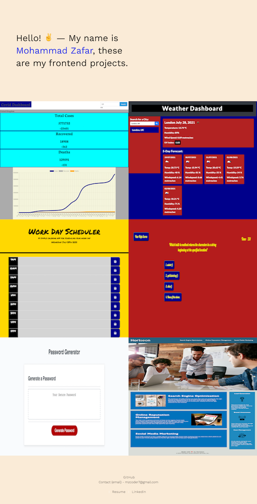

# Frontend portfolio

An updated portolio page, featuring my recent frontend projects.  
Includes descriptions, screenshots, links to repositories and live applications.   
Also contains a one page resume outlining coding skills gained so far and future goals. 

## Working links 
* Repo: https://github.com/mz0121coder/Frontend-portfolio/
* Deployed: https://mz0121coder.github.io/Frontend-portfolio/

## Screenshot

